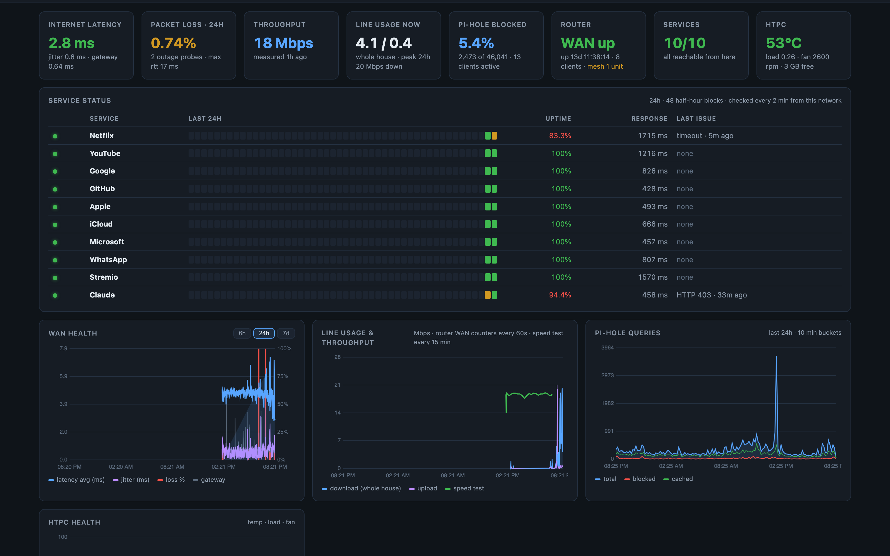
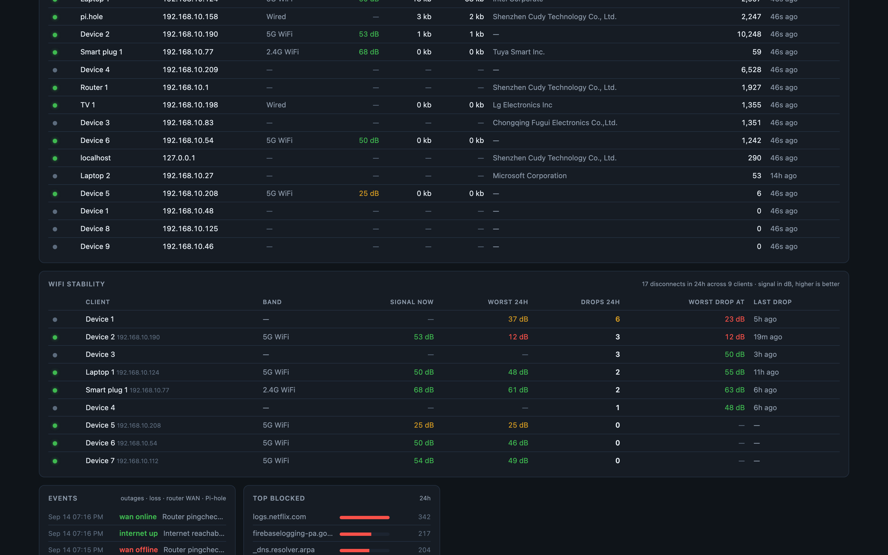
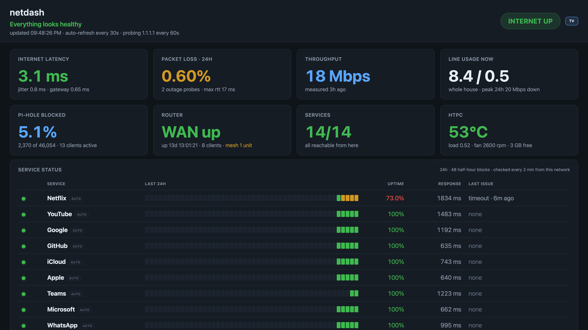

# netdash

A single-page, self-hosted home network dashboard. One glance answers *"is it my internet, my WiFi, or the site?"* — and keeps a timestamped record so you can answer it after the fact too.

Built for a low-power always-on box (in my case an old laptop running Pi-hole and a Tailscale exit node). One Python process, SQLite, no external assets — **the page still renders when the internet is down**, which is precisely when you'll be looking at it.





<details>
<summary>TV mode (1080p, sofa distance)</summary>


</details>

*Screenshots taken with `?demo=1`, which anonymises hostnames and MACs — see below.*

## What it shows

**The verdict** — one sentence in the header that says whose problem it is, synthesised from everything below:

> *Netflix is down — your line is fine, that's on them*
> *line saturated — 17 of 18 Mbps in use, anything else will buffer*
> *Internet down — your router is fine, the line to the ISP is out*

It's careful about blame: a service that fails while your own line is saturated or lossy is reported as *"probably the saturated line, not them."*

**Top row — the glance**
- Internet status pill (turns red and pulses on outage)
- Latency + jitter, 24h packet loss, last speed test
- Line usage right now — whole house, from the router's WAN counters
- Pi-hole block rate, router status, **services up (n/n)**, host machine temperature / load / fan

**Service status** — the classic status-page strip for the services you actually use (Netflix, YouTube, GitHub… configurable). Every 2 minutes each one gets an HTTP check with the timing split by phase — DNS → TCP → TLS → first byte — so a failure says *where* it failed. 24h uptime %, current response time, last issue. Any HTTP answer below 500 counts as reachable (bot-protection 403s are still "up").

**Charts** (6h / 24h / 7d)
- WAN health: latency, jitter, and packet loss as thin red spikes, with a gateway line so you can tell LAN trouble from ISP trouble
- Line usage and throughput: continuous WAN download/upload from the router plus periodic speed tests
- Pi-hole queries (total / blocked / cached)
- Host health (package temp, load, fan)

**Tables**
- Devices: every known device with live online state, band, **WiFi signal**, **real-time per-device down/up**, vendor, DNS activity
- WiFi stability: per client, disconnects in 24h and the signal strength at the moment of each drop — the thing that finds the phone at the edge of coverage
- Events: internet down/up (attributed LAN vs WAN), packet-loss events, router WAN state changes, Pi-hole warnings — all in one feed

## Data sources

| Source | How | Interval |
|---|---|---|
| WAN health | `ping -c10 -i0.2` to gateway, ISP box, and `1.1.1.1` | 60s |
| Throughput | 5 MB download from Cloudflare — **skipped if the line is already busy**, so it never fights a stream or misreports | 15 min |
| Host machine | `/proc`, thermal zones, `sensors`, NIC byte deltas | 60s |
| Services | `curl` per service with `%{time_namelookup}`/`connect`/`starttransfer` and `%{exitcode}` | 2 min |
| Pi-hole v6 | REST API, proxied live (session cached, re-auth on 401) | on page load |
| Cudy router | Stock-firmware web endpoints (see below) | 60s; syslog every 5 min |

Everything time-series lands in `netdash.db` (SQLite) with 7-day retention.

## Install

Tested on Pop!_OS / Ubuntu 22.04, Python 3.10.

```bash
sudo mkdir -p /opt/netdash && sudo chown $USER /opt/netdash
git clone https://github.com/dnaidoo621/netdash.git /opt/netdash
cd /opt/netdash
python3 -m venv venv && ./venv/bin/pip install -r requirements.txt

cp config.env.example config.env
chmod 600 config.env
$EDITOR config.env            # passwords, targets, interface names

sudo install -m 644 netdash.service /etc/systemd/system/
sudo systemctl daemon-reload
sudo systemctl enable --now netdash
```

Then open `http://<host>:8080`. Edit `netdash.service` if your user isn't `darren` or you want a different port.

Requirements on the host: `ping` (unprivileged ICMP — default on Ubuntu), `curl` ≥ 7.75 (for `%{exitcode}`), and `lm-sensors` for the fan reading (optional; shows `?` without it).

### Choosing which services to watch

Copy `services.json.example` to `services.json` and edit. Pick endpoints that answer plainly — `https://www.google.com/generate_204` is ideal; a marketing homepage that 302s three times is fine too since checks follow redirects. Restart the service after changing it.

### TV mode

For a 1080p TV viewed from the sofa, open the page once as

```
http://<host>:8080/?tv=1
```

It persists in that browser's `localStorage`. Bigger type, four tiles per row, denser panels hidden. There's also a **TV** toggle in the header. Press F11 for full-screen.

### Demo mode (for sharing screenshots)

```
http://<host>:8080/?demo=1
```

Replaces hostnames with generic labels by vendor (`Laptop 1`, `iPhone 2`, `Smart plug 1`…), masks MAC addresses, and hides the top-permitted-domains panel (which fingerprints what you use). Per-URL only — never persisted, so the live dashboard is unaffected. The dashboard API also never exposes the WAN public IP or router MAC, regardless of mode.

## Cudy router integration

The router panels come from a Cudy M1800 (v2.0, fw 2.1.3) **without flashing it**. The stock firmware is LuCI underneath, but Cudy strips the ubus ACL to nothing and replaces the standard controllers — so `router.py` logs in exactly as the browser does and reads the HTML fragments their own UI polls.

- **Login:** `luci_password = sha256(sha256(password + salt) + token)` with `_csrf`, `salt`, `token` taken fresh from the login page each time (which is served with HTTP 403). Username is `admin`.
- **Endpoints used:** `admin/status/bandwidth?iface=eth1.2` (WAN counters), `admin/network/devices/devlist?detail=1` (per-device band, signal, rate, duration), `admin/network/{wan,mesh,system}/status?detail=1`, `admin/system/status/syslog`.
- **Syslog is parsed for** `pingcheck … changed to ONLINE/OFFLINE` (WAN state) and `raN disassoc: MAC, rssi: N` (WiFi drops with signal).

Things that bit me, so you don't have to:
- **Re-login must clear the cookie jar first.** A still-valid `sysauth` cookie makes the router serve the dashboard instead of the login form, so the re-auth "fails" and every router panel goes dark after ~25 minutes.
- **The rate cell lists upload before download.** Anchor on the `arrow-up` / `arrow-down` icons, never on position.
- Status cells render twice (desktop + mobile copy). `_undouble()` collapses `"X X"` → `"X"`.
- Signal is a positive SNR-style dB, higher is better. I colour ≥40 good, <25 poor.

It's unofficial. A firmware update could change the HTML, in which case the router panels go empty rather than anything breaking. The probes in `tools/` are what I used to reverse it — useful if you need to re-map endpoints or adapt to another Cudy model.

## API

Everything the page uses is plain JSON, handy for `curl` when something looks wrong:

| Endpoint | Returns |
|---|---|
| `/api/overview` | Headline state: **verdict**, internet up, latest probes, throughput, machine, Pi-hole summary, router summary, services up/down |
| `/api/services?hours=24` | Per service: latest result, uptime %, 48-bucket strip, last failure and reason |
| `/api/wan?hours=24` | Probe timeseries (loss, rtt, jitter) per target |
| `/api/throughput?hours=24` | Speed-test samples |
| `/api/router/wan?hours=24` | Router WAN Mbps timeseries |
| `/api/router/devices` | Live per-device band / signal / rate |
| `/api/router/wifi?hours=24` | Per-client drops and signal aggregates |
| `/api/router/signal?mac=…` | One client's signal + rate history |
| `/api/devices` | Merged device table (Pi-hole + ARP + router) |
| `/api/events?hours=72` | Event feed |
| `/api/pihole/{history,top,messages}` | Pi-hole passthroughs |

## Security notes

- The page has **no authentication**. It's read-only network stats intended for a home LAN (and Tailscale). Don't expose port 8080 to the internet.
- `config.env` holds the Pi-hole and router passwords. It's gitignored and should be `chmod 600`. Nothing in the repo contains a secret.
- Router access is read-only — `router.py` only ever issues GETs after login.

## Layout

```
app.py              FastAPI app: collector loop, API, static serving
router.py           Cudy stock-firmware client
static/index.html   the whole UI — vanilla JS, canvas charts, no dependencies
netdash.service     systemd unit
config.env.example  configuration template
services.json.example  which services to health-check
tools/              the probes used to reverse-engineer the Cudy endpoints
```
